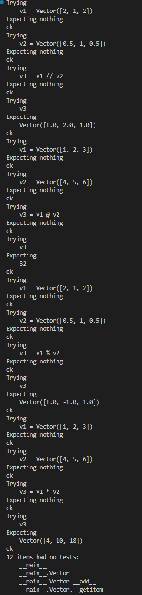
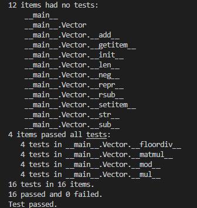

# Tercera tarea de APA 2023: Multiplicaciones de vectores y ortogonalidad

## Nom i cognoms: Victor Ceballos Fouces

El fichero `algebra/vectores.py` incluye la definición de la clase `Vector` con los
métodos desarrollados en clase, que incluyen la construcción, representación y
adición de vectores, entre otros.

Añada a este fichero los métodos siguientes, junto con sus correspondientes
tests unitarios.

### Multiplicación de los elementos de dos vectores (Hadamard) o de un vector por un escalar

- Sobrecargue el operador asterisco (`*`, correspondiente a los métodos `__mul__()`,
  `__rmul__()`, etc.) para implementar el producto de Hadamard (vector formado por
  la multiplicación elemento a elemento de dos vectores) o la multiplicación de un
  vector por un escalar.

  - La prueba unitaria consistirá en comprobar que, dados `v1 = Vector([1, 2, 3])` y
    `v2 = Vector([4, 5, 6])`, la multiplicación de `v1` por `2` es `Vector([2, 4, 6])`,
    y el producto de Hadamard de `v1` por `v2` es `Vector([4, 10, 18])`.

- Sobrecargue el operador arroba (`@`, multiplicación matricial, correspondiente a los
  métodos `__matmul__()`, `__rmatmul__()`, etc.) para implementar el producto escalar
  de dos vectores.

  - La prueba unitaria consistirá en comprobar que el producto escalar de los dos
    vectores `v1` y `v2` del apartado anterior es igual a `32`.

### Obtención de las componentes normal y paralela de un vector respecto a otro

Dados dos vectores $v_1$ y $v_2$, es posible descomponer $v_1$ en dos componentes,
$v_1 = v_1^\parallel + v_1^\perp$ tales que $v_1^\parallel$ es tangencial (paralela) a
$v_2$, y $v_1^\perp$ es normal (perpendicular) a $v_2$.

> Se puede demostrar:
>
> - $v_1^\parallel = \frac{v_1\cdot v_2}{\left|v_2\right|^2} v_2$
> - $v_1^\perp = v_1 - v_1^\parallel$

- Sobrecargue el operador doble barra inclinada (`//`, métodos `__floordiv__()`,
  `__rfloordiv__()`, etc.) para que devuelva la componente tangencial $v_1^\parallel$.

- Sobrecargue el operador tanto por ciento (`%`, métodos `__mod__()`, `__rmod__()`, etc.)
  para que devuelva la componente normal $v_1^\perp$.

> Es discutible esta elección de las sobrecargas, dado que extraer la componente
> tangencial no es equivalente a ningún tipo de división. Sin embargo, está
> justificado en el hecho de que su representación matemática es dos barras
> paralelas ($\parallel$), similares a las usadas para la división entera (`//`).
>
> Por otro lado, y de manera *parecida* (aunque no idéntica) al caso de la división
> entera, las dos componentes cumplen: `v1 = v1 // v2 + v1 % v2`, lo cual justifica
> el empleo del tanto por ciento para la componente normal.

- En este caso, las pruebas unitarias consistirán en comprobar que, dados los vectores
  `v1 = Vector([2, 1, 2])` y `v2 = Vector([0.5, 1, 0.5])`, la componente de `v1` paralela
  a `v2` es `Vector([1.0, 2.0, 1.0])`, y la componente perpendicular es `Vector([1.0, -1.0, 1.0])`.

### Entrega

#### Fichero `algebra/vectores.py`

- El fichero debe incluir una cadena de documentación que incluirá el nombre del alumno
  y los tests unitarios de las funciones incluidas.

- Cada función deberá incluir su propia cadena de documentación que indicará el cometido
  de la función, los argumentos de la misma y la salida proporcionada.

- Se valorará lo pythónico de la solución; en concreto, su claridad y sencillez, y el
  uso de los estándares marcados por PEP-ocho.

#### Ejecución de los tests unitarios

Inserte a continuación una captura de pantalla que muestre el resultado de ejecutar el
fichero `algebra/vectores.py` con la opción *verbosa*, de manera que se muestre el
resultado de la ejecución de los tests unitarios.




#### Código desarrollado

Inserte a continuación el código de los métodos desarrollados en esta tarea, usando los
comandos necesarios para que se realice el realce sintáctico en Python del mismo (no
vale insertar una imagen o una captura de pantalla, debe hacerse en formato *markdown*).

```python
def __mul__(self, other):
        """
        Multiplica el vector por otro vector usando el producto de Hadamard, o por un escalar.
        >>> v1 = Vector([1, 2, 3])
        >>> v2 = Vector([4, 5, 6])
        >>> v3 = v1 * v2
        >>> v3
        Vector([4, 10, 18])
        """
        if isinstance(other, (int, float, complex)):
            return Vector(uno * other for uno in self)
        else:
            return Vector(uno * otro for uno, otro in zip(self, other))

    __rmul__ = __mul__

    def __matmul__(self, other):
        """
        Realiza el producto escalar entre dos vectores.
        >>> v1 = Vector([1, 2, 3])
        >>> v2 = Vector([4, 5, 6])
        >>> v3 = v1 @ v2
        >>> v3
        32
        """
        if not isinstance(other, Vector):
            raise TypeError("El operando debe ser un objeto de la clase Vector")

        if len(self) != len(other):
            raise ValueError("Los vectores deben tener la misma longitud")

        resultado = 0
        for x, y in zip(self.vector, other.vector):
            resultado += x * y

        return resultado

    __rmatmul__ = __matmul__ 

    def __floordiv__(self, other):
        """
        Retorna la componente tangencial de self respecto a other.
        >>> v1 = Vector([2, 1, 2])
        >>> v2 = Vector([0.5, 1, 0.5])
        >>> v3 = v1 // v2
        >>> v3
        Vector([1.0, 2.0, 1.0])
        """
        if not isinstance(other, Vector):
            raise TypeError("El argumento debe ser un vector.")

        v1 = self
        v2 = other
        v2_norma_cuadrado = sum(componente ** 2 for componente in v2)
        producto_escalar = sum(v1[i] * v2[i] for i in range(len(v1)))
        tangencial = v2 * (producto_escalar / v2_norma_cuadrado)

        return tangencial
    
    
    def __mod__(self, other):
        """
        Devuelve la componente normal de v1 perpendicular a v2.
        >>> v1 = Vector([2, 1, 2])
        >>> v2 = Vector([0.5, 1, 0.5])
        >>> v3 = v1 % v2
        >>> v3
        Vector([1.0, -1.0, 1.0])
        """
        
        if not isinstance(other, Vector):
          raise TypeError("El otro objeto debe ser un vector.")
        
        if len(self) != len(other):
          raise ValueError("Los vectores deben tener la misma longitud.")
        
        escalar = self @ other / (other @ other)
        v1paralelo = other * escalar
        v1perpendicular = self - v1paralelo
        
        return v1perpendicular

import doctest
doctest.testmod(verbose = True)
```

#### Subida del resultado al repositorio GitHub y *pull-request*

La entrega se formalizará mediante *pull request* al repositorio de la tarea.

El fichero `README.md` deberá respetar las reglas de los ficheros Markdown y
visualizarse correctamente en el repositorio, incluyendo la imagen con la ejecución de
los tests unitarios y el realce sintáctico del código fuente insertado.
